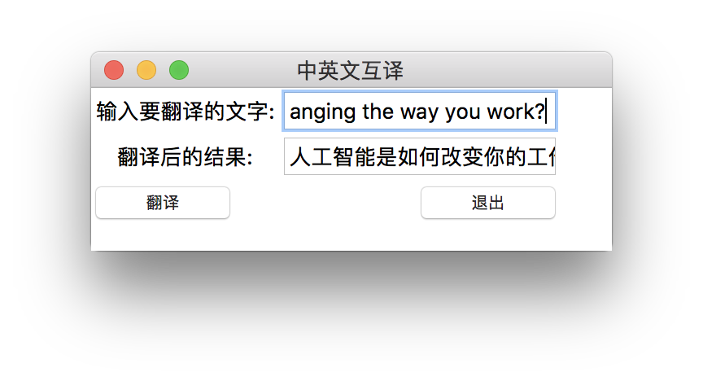
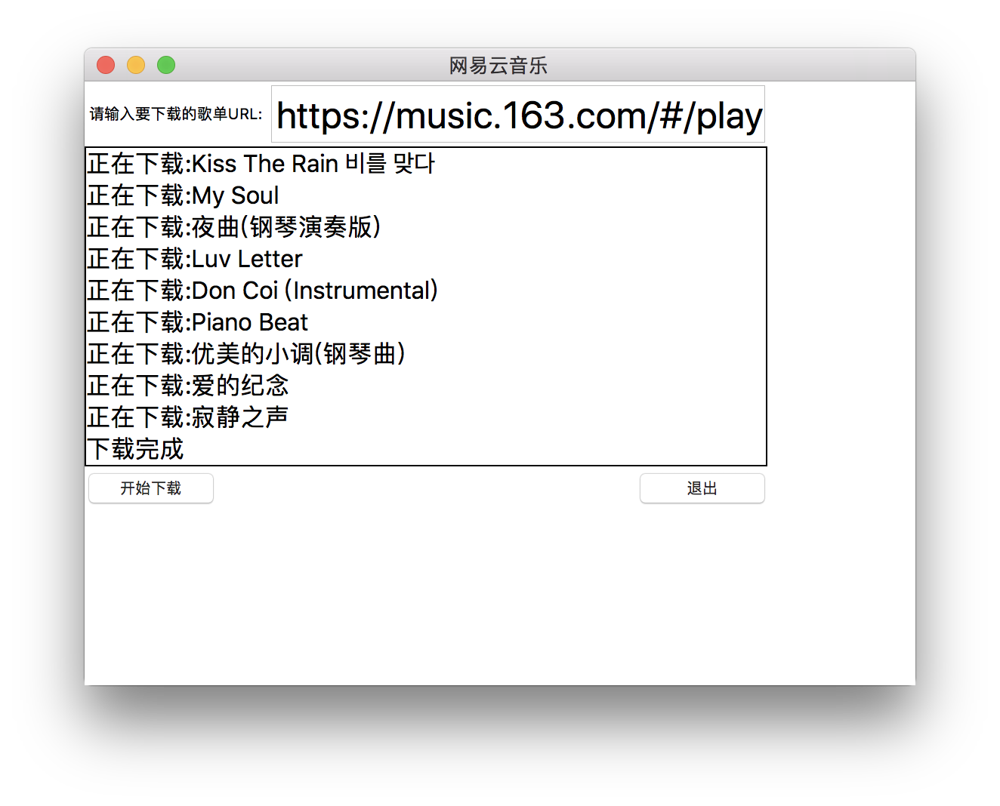

# Tkinter-Example
---

python 3.6

* formatters for Python

```
$ pip install yapf
$ yapf *.py
```

# Reference 
---

[Tkinter-By-Example](https://github.com/Dvlv/Tkinter-By-Example)

[Python 开发音乐下载器实践（附加桌面翻译软件开发）](https://gitbook.cn/books/5b4d510905a002571926ed7e/index.html)

# Screenshots
---


translate


music

# exe
---

```
$ pip install pyinstaller
$ pyinstaller -F -w xxx.py
```

download: <https://github.com/iOSDevLog/Tkinter-Example/releases>

# Licence
---

`Tkinter-Example` is released under the MIT license. See [LICENSE](LICENSE) for details.
